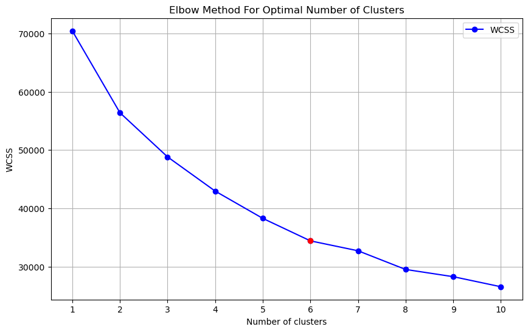

## Finding the Best Number of Clusters: Elbow Method

**Understanding the Problem:**
We want to figure out how many groups (or clusters) our data should be divided into. A popular method for this is called the "elbow method."

**What We'll Do:**

1. **Try different numbers of groups:** We'll start by trying different numbers of groups for our data.
2. **Measure how well the data fits into each group:** For each number of groups, we'll calculate something called the "Within-Cluster Sum of Squares" (WCSS). This tells us how spread out the data points are within each group. Smaller WCSS is better.
3. **Plot the results:** We'll create a graph showing how the WCSS changes as we increase the number of groups. This graph is called the "elbow curve."
4. **Find the "elbow":** The "elbow" is the point on the graph where the line starts to bend. This is often a good indication of the optimal number of groups.

**Why it works:**

* As we increase the number of groups, the WCSS naturally decreases. This is because each data point will be closer to its assigned group center.
* However, at some point, adding more groups doesn't significantly reduce the WCSS. This is the "elbow" in the curve.
* Beyond the elbow, adding more groups might not provide much benefit, and it could even make the results worse.
By following these steps and understanding the logic behind the elbow method, we can effectively determine the optimal number of clusters for your data.

# Define the range of cluster numbers to evaluate
```
cluster_range = range(1, 11)  # Testing from 1 to 10 clusters
wcss = []
for i in cluster_range:
    kmeans = KMeans(n_clusters=i, init='k-means++', max_iter=300, n_init=10, random_state=0)
    kmeans.fit(df_scaled)
    wcss.append(kmeans.inertia_)
```

# Plot the Elbow Curve and compute differences to identify the elbow
```
plt.figure(figsize=(10, 6))
plt.plot(cluster_range, wcss, marker='o', linestyle='-', color='b', label='WCSS')
diffs = np.diff(wcss)
second_diffs = np.diff(diffs)
elbow_index = np.argmin(second_diffs) + 1  # Add 1 to align with cluster numbers
```
# Plot the elbow point
```
plt.plot(elbow_index, wcss[elbow_index - 1], 'ro')  # Marking the elbow point with red
plt.title('Elbow Method For Optimal Number of Clusters')
plt.xlabel('Number of clusters')
plt.ylabel('WCSS')
plt.xticks(cluster_range)
plt.grid(True)
plt.legend()
plt.show()
print(f'The optimal number of clusters is approximately: {elbow_index}')
```

